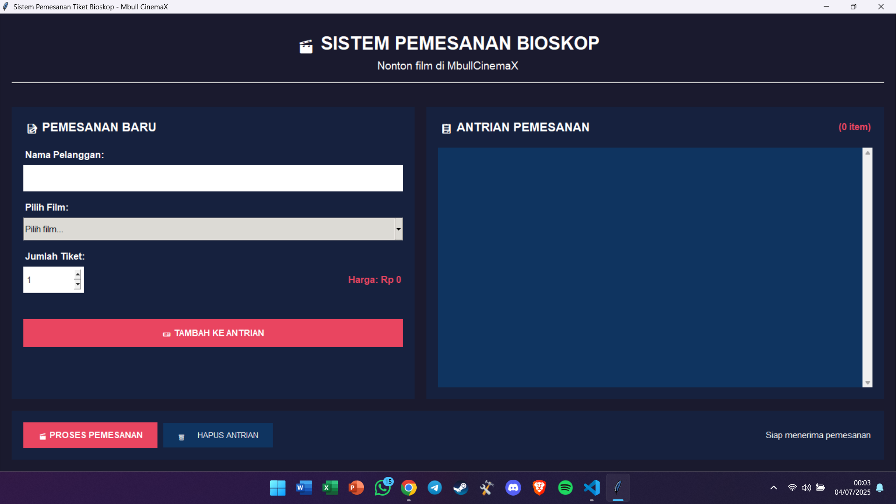

# 🎟️ TiketQ - Sistem Pemesanan Tiket Bioskop | UAS Struktur Data



## 📖 Deskripsi Singkat

**TiketQ** adalah aplikasi GUI yang dibangun menggunakan Python dan Tkinter, dirancang untuk mengelola pemesanan tiket bioskop dengan menggunakan struktur data **Queue (antrian)**. Aplikasi ini mengimplementasikan prinsip **First In First Out (FIFO)**, di mana setiap pemesanan akan diproses sesuai urutan masuk. Pengguna dapat menambahkan, memproses, atau menghapus seluruh antrian dengan antarmuka yang ramah pengguna.

---

## 💡 Fitur Utama

- Pemesanan tiket dengan input nama pelanggan, film, dan jumlah tiket.
- Perhitungan harga tiket otomatis (Rp50.000 per tiket).
- Menampilkan daftar antrian pemesanan dengan detail waktu.
- Proses pemesanan satu per satu (FIFO).
- Hapus seluruh antrian dengan satu klik.
- Validasi input dan notifikasi interaktif.

---

## 🛠️ Teknologi yang Digunakan

- **Python 3**
- **Tkinter (GUI)**
- **Collections Deque** (untuk struktur data antrian)
- **Messagebox & Combobox** (elemen interaktif)

---

## 📄 Cara Menjalankan Aplikasi

1. Pastikan Python 3 telah terinstal di perangkat Anda.
2. Jalankan file `run.py` menggunakan terminal atau editor favorit Anda:
   ```bash
   python run.py
